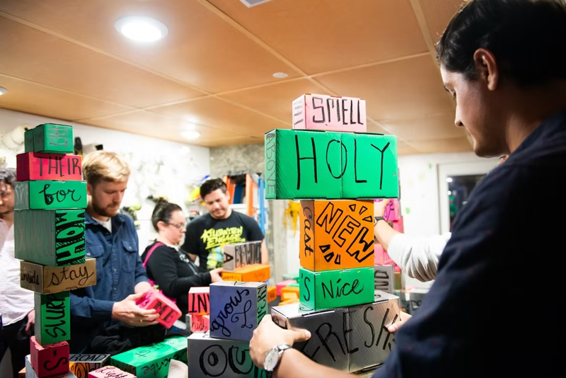

I took a 2D design class at [City College](https://www.ccsf.edu/). One of the projects was to create a facsimile of a photograph using only 2 colors of construction paper. I choose [a photo used in the promotional materials for the movie Dogtown and the Z-boys](https://images.app.goo.gl/FK5Sxia5otxfTZXU6).

It's like those refrigerator magnets with words written on them, but 3D! And gravity, instead of magnetism...

I created these, with the help of a [few other artist friends](https://syzygysf.com), for an art show in which the theme was collaboration, allowing guests to collaboratively create towering works of poetry.

Some party fliers I made. I also have to take some responsibility for the concepts behind them.

It was summer, so we wanted a beachy theme. But also, cows from outer space.

Spring-themed masquerade.

Halloween party, with the conceit that there was just a big conference in town: World wide witches and warlocks. What's scarier than witches? The masks and performances we have to put on at professional conferences and networking events.

Some portraits from my sketchbook.

It's going to get weird now.

