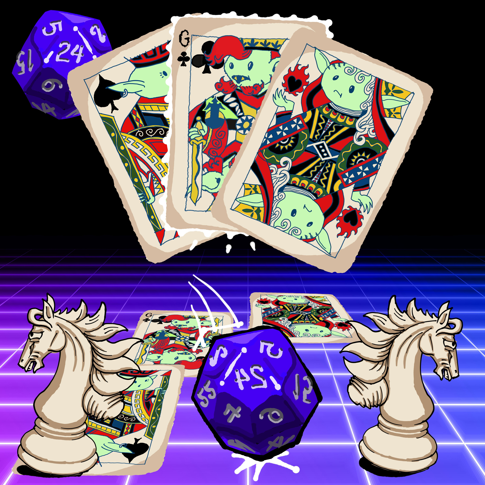

I've been wanting an opportunity for all kinds of game designers and game players to come together and explore the art and craft of games. I wanted something more low-key than a game jam, less formal than a play testing event, and more playful than a networking event. Inspired by a now defunct event called [Sandbox Open Mic](https://cargocollective.com/lethalbeef/Sandbox-Open-Mic), I decided to start hosting a similar monthly event.

I hope for it to become a place and time where game design is done in public, with a radically inclusive ethos. I hope that it helps strengthen the local game development community, and in particular, reinvigorates the [_live games_](https://www.deepfun.com) scene which seems to have all but disappeared during the Covid-19 pandemic. The reason I'm interested in live games is that they have an inherently inclusive, and even contagious quality. They tend to not require a lot of expensive or delicate materials, and they tend to scale well. This lowers the barriers for both designers and players.
