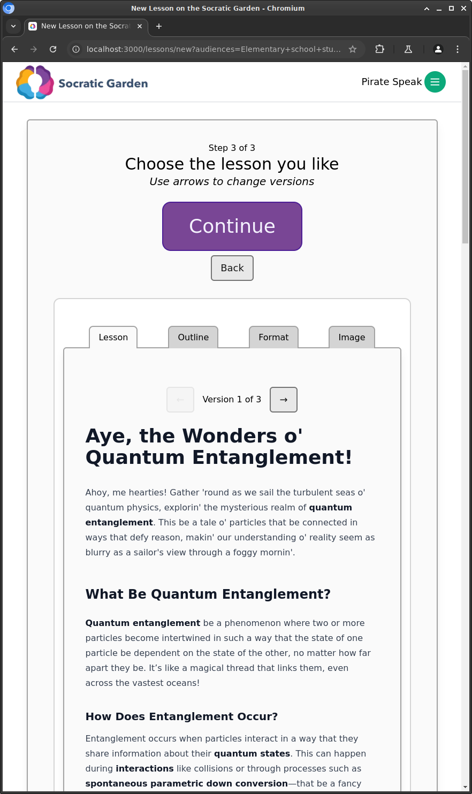

I've been lucky to be able to contribute both illustration and programming to a project called [Socratic Garden](https://socratic.garden). The basic idea is to leverage LLM technology to allow instructors to ghostwrite "textbooks" that can engage in dialogues with students, facilitating active, constructivist learning. This seems to work especially well for STEM subjects. Perhaps this kind of technology will not only improve learning outcomes, but take some burden off of overworked teachers. That's the hope, at least.

If nothing else, the ability to have things explained by a pirate might make dense topics a bit more approachable.
