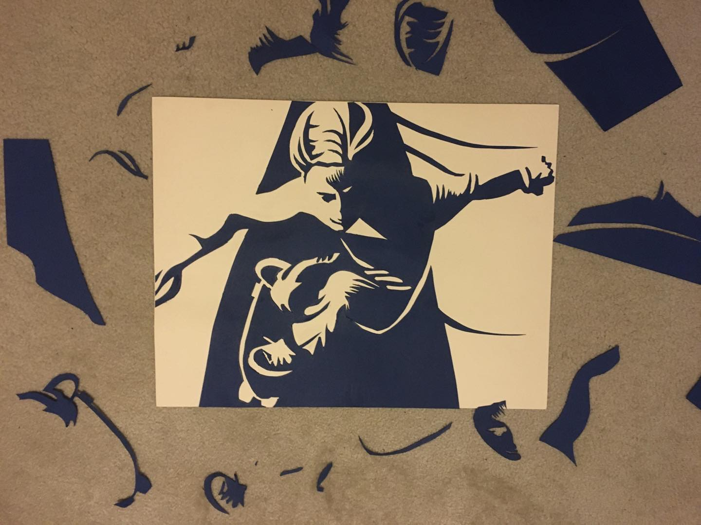

I took a 2D design class at [City College](https://www.ccsf.edu/). One of the projects was to create a facsimile of a photograph using only 2 colors of construction paper. I choose [a photo used in the promotional materials for the movie Dogtown and the Z-boys](https://images.app.goo.gl/FK5Sxia5otxfTZXU6).
