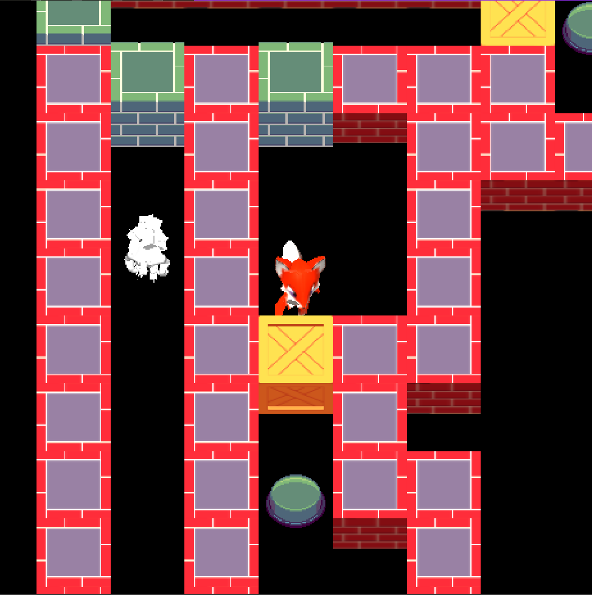

A game inspired by Chip's Challenge. You control a character that can push blocks around, collect items... Standard fair for a tile-based puzzler, _but with zombies!_ The zombies also interact with the tiles. Though their behavior is predefined, the cumulative effect of their movements can be hard to predict.

<a href="https://hyperpoetic.net" class="Button h1">Play in your browser</a>

(_Still in development as of April 2025_)

Now with touch screen controls!

Techno-babble

Written in TypeScript using THREE.js for rendering, Blender for 3D assets. A simple Node.js Express backend facilitates the level editor.

Though essentially a 2D game, I'm using a 3D graphics library with an orthographic camera because of it's superior capabilities and performance compared to available 2D libraries. It also gives me the flexibility to use 3D models or sprites implemented as billboards. I use a post-processor to make everything look like pixel art.

At the core is a reactive state manager/ECS that I wrote from scratch which plays well with the editor backend.

I also devised [spatially message passing system](blog/zmbn-spatial-messages) to allow entities (e.g. the player and a block) to communicate with each other without being tightly coupled.

